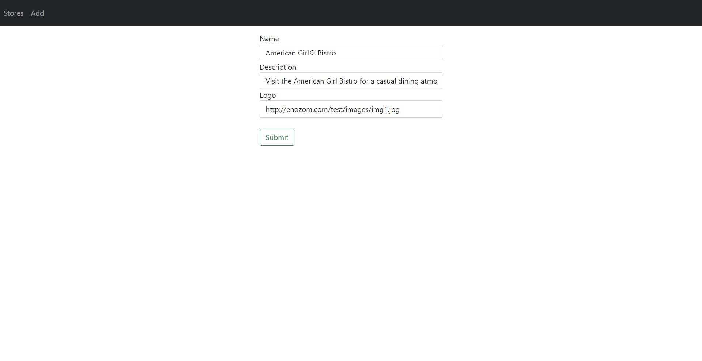
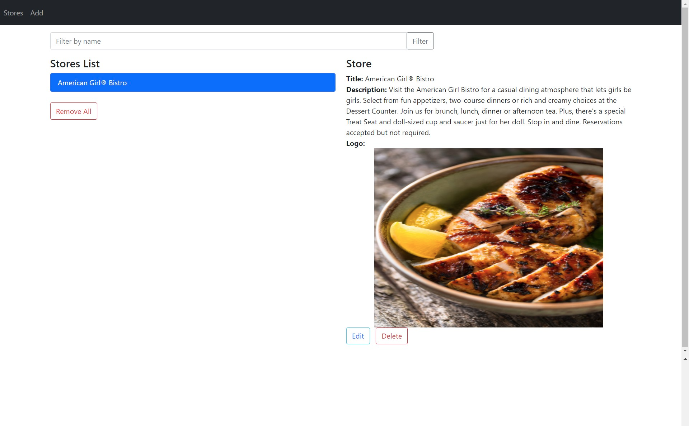
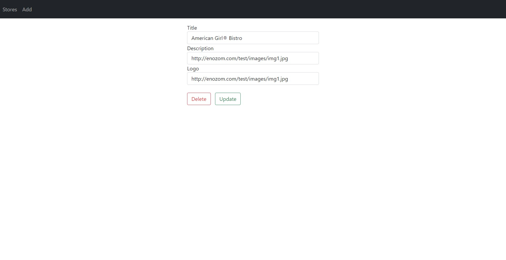

# Food Court Management App Frontend

This is the Front-end for Food Court Management App.

This project is written using Angluar10 & TypeScript.

## How to install
1. First you need to download NodeJS Installer from [here](https://nodejs.org/en/) & install it
2. Then you need to install Angluar CLI via npm, run this command `npm install -g @angular/cli`
3. Now you're ready to clone the project, just run `git clone https://github.com/HossamMamd0uh/food-court-management-app-frontend`

## How to run
1. Navigate to project directory and run `npm install`
2. To start the server run `ng serve`
3. The server by default is listening on port **4200**
4. For the full experience you should clone also this repo -> https://github.com/HossamMamd0uh/food-court-management-app-backend, it's the Back-end of the project, you'll also find a documentation over there on how to run it

Run `ng build` for production build

## Some screenshots taken out of the live system
#### Add a new store

#### Store display area

#### Edit a store

Also, you can check a live [demo](http://ec2-18-117-102-200.us-east-2.compute.amazonaws.com/stores)